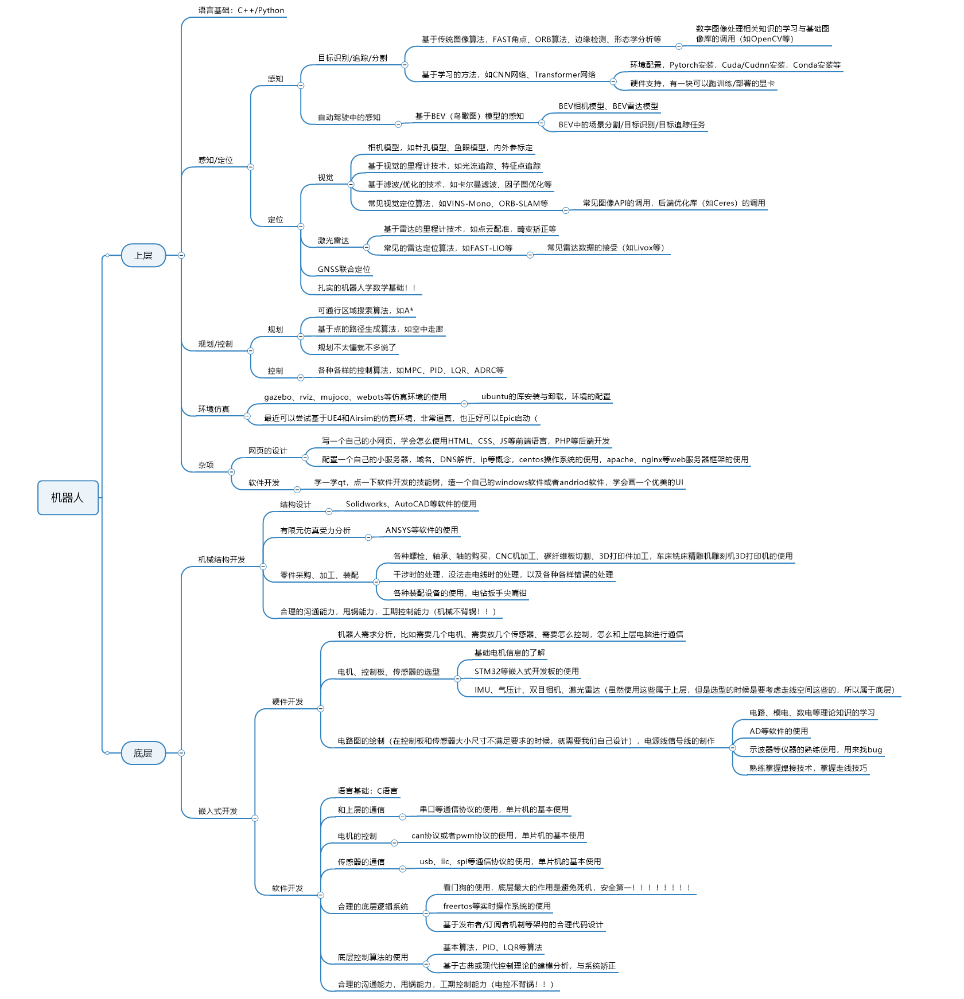

# HITSZ-Auto-Wiki - 野生技术指南

<!--
1. 通过 [Shields.io](https://shields.io/) 生成如下的徽章，标注课程的基本信息。
2. 请根据课程的具体内容增删仓库的子文件夹。子文件夹建议使用小写英文，并且添加 README.md。
3. 关于课程的描述可以不止以下几个方面，酌情增删。
4. hoa.moe 生成本课程对应页面后，请将页面链接复制到 GitHub 仓库的 About/Website 中。
5. 可以在 GitHub 页面的 About/Topics 中为课程添加话题名称。
-->

## 授课教师

- （教师名）
  - 授课风格：
  - 听课建议：
  - ……

## 关于考试

## 学习建议
# 综述
自动化其实是一门特别繁杂的课，涉及机械、电气、计算机等多个学科的专业知识  

在短短大学四年的学习中，可能要上工程制图、机械设计、电路、模电、数电等多门课，十分恶心  

这些课吧，有些可能有用，有些可能卵用没有，就比如机械设计，我是真没想明白有啥用，教会我怎么选螺丝？（笑）  

但话说回来，自动化这些课究竟是要干什么？  

没错，我也没想明白。  

但我大概知道一件事，通过大学四年的学习，有的同学坚定了自己转码的信心，有的同学找到了自己喜欢的机器人研究方向。以我做例子，在四年的技术和理论学习中，我大概对如何成为一名合格的机器人工程师有了一个初步的了解。  

对，这么多课，学校的目的应该是想让大伙成为一个全栈机器人工程师，但可惜确实有点难，对于大部分人来说，混个毕业，混个研究生，去找个30w的码农工作，就完事了。所以不想系统了解机器人工程的同学其实可以离开了。  

画了一张小图，大概浓缩了一个我对机器人系统的理解，也大概是这大学四年以来我点的技能树吧。  

  

首先是为啥要分成上层和底层捏，就跟人一样，大脑是上层，脊柱是底层，如果脊柱废了不影响大脑思考，大脑有一点点问题不影响人活着（虽然可能不太恰当但差不多是这个意思  

写了好多好多，也不是说每个技能树都要点到，就是我每个寒假或者暑假回家的时候就会点一个技能树，积少成多就这么多啦  

本部分就会就这里面涉及到的技术进行讲解，我会一个一个部分的写文档，并且附上相应的论文进行讲解，希望能坚持下来吧哈哈哈。  

希望看到这里的人都能成为稚晖君，加油吧朋友们。

> lmh. 2022.11.13 01:09
